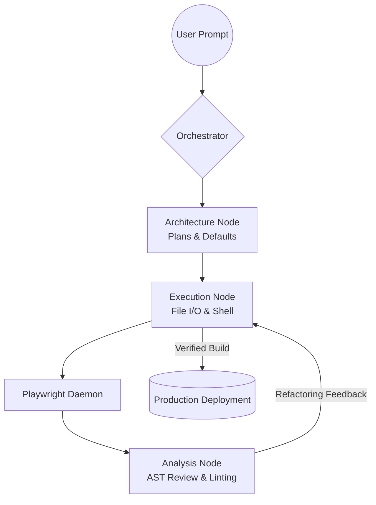

<div align="center">
  <h1>HiveCenter</h1>
  <p><strong>Local-first multi-agent orchestration for software tasks (Flask + Ollama + policy sandbox)</strong></p>

  <p>
    <a href="https://github.com/BerkerCN/HiveCenter/actions/workflows/ci.yml"></a>
    <a href="https://github.com/BerkerCN/HiveCenter/releases/tag/v0.2-beta"></a>
    <a href="https://python.org"></a>
    <a href="https://opensource.org/licenses/MIT"></a>
  </p>
</div>

---

## 1. Project Vision & Purpose

**HiveCenter** is a **local-first** orchestration stack: a Flask backend and a web dashboard drive a multi-role loop (Architect → Coder → Inspector) against tools on your machine, with policy limits, audit logging, and optional Ollama (or other configured) models.

The **long-term direction** is broader agentic automation (research, QA, security, memory). What ships **today** is a concrete, inspectable codebase: policy-guarded file/shell tools, checkpoints, memory APIs, GPU health endpoints, and integration hooks for browser automation and embeddings—see [docs/README.md](docs/README.md) for an engineer-facing map of routes and modules.

**Reality check (read before judging the README):** autonomous agents on a real host are inherently high-risk. This repository does not promise unattended “production-grade” delivery for arbitrary goals; it gives you **transparent controls** (allowlists, approvals, audit) and a loop you can extend. Treat marketing-sounding feature names in the codebase as **experimental modules** unless you have verified them in your environment.

---

## 2. Core Capabilities: What HiveCenter Achieves

The bullets below mix **implemented tooling**, **integration hooks**, and **design intent**—confirm behavior in your tree (especially under `hivecenter/*`) before assuming a feature is production-complete.

HiveCenter bridges the gap between Large Language Models (LLMs) and the physical host machine. It grants sandboxed agents deep, programmatic read/write access to the operating system, allowing them to dynamically achieve the following without human intervention:

### 🧠 Autonomous Architecture & Engineering
*   **System Design:** Automatically generates Product Requirements Documents (PRD), selects optimal tech stacks, and designs folder hierarchies before writing a single line of code.
*   **Deep Research:** Instructs sub-agents to browse the web (`[WEB_PILOT]`), read API documentation, and store findings in a RAG (Retrieval-Augmented Generation) graph memory prior to implementation.
*   **Recursive Refactoring:** Employs AST (Abstract Syntax Tree) translation capabilities to migrate entire legacy codebases from one language to another automatically (e.g., Python to Rust).

### 🛡️ Deterministic QA & Self-Healing
*   **Runtime Error Correction:** If a generated script crashes, the Inspector Agent reads the `stderr` traceback, cross-references it with the AST, and autonomously writes a patch to correct the bug in a continuous loop.
*   **Visual UI Regression Testing:** Uses headless browser integration (Playwright) to take pixel-perfect screenshots of rendered web applications. A Vision AI model critiques the CSS layout to ensure visual requirements are met.
*   **Live DOM Observation:** Deploys a background daemon (`[GHOST]`) that continuously watches local web servers, instantly alerting the orchestrator if a console error or crash screen occurs.

### ⚙️ DevOps & Execution Sandboxing
*   **Environment Bootstrapping:** Intelligently discovers missing packages (`npm install`, `pip install`) and automatically installs host dependencies.
*   **Ephemeral Containerization:** Executes high-risk, unverified code inside strictly isolated 30-second Docker containers (`[DOCKER_SPAWN]`) before applying logic directly to the host system.
*   **One-Click Deployment:** Bridges the gap to production by automatically pushing 100% verified working code to Vercel, Fly.io, or remote SSH servers.

---

## 3. The Orchestration Pipeline

HiveCenter enforces a strict, multi-persona event loop. No single agent is trusted to blindly write and execute logic. Instead, work is passed through a deterministic assembly line:



- **The Architect:** Responsible for strategy. Resolves ambiguities by enforcing sensible default tech stacks, mapping repository architectures, and creating verifiable step-by-step Execution Plans.
- **The Execution Coder:** The "hands" of the system. Reads the Architect's plan and possesses the permissions to invoke complex systemic shell operations, overwrite files, and spawn background testing severs.
- **The Inspector (QA):** The critical safety valve. It grades the Execution Coder's output out of 100. If code crashes, tests fail, or poor architectural patterns are noticed, the Inspector rejects the output and forces the Coder into a self-healing iteration loop.

---

## 4. Advanced System Integrations (The Toolbox)

The `hivecenter/tools.py` layer exposes many **tag-driven** capabilities (file I/O, shell with policy, semantic search, git helpers, etc.). Exact behavior depends on your `config.json` and model outputs—verify before relying on any path in production.

| Area | Example tags | Notes |
| :--- | :--- | :--- |
| **Source control** | `[GIT]`, … | Read-oriented and safety-bounded git operations (see tool implementation). |
| **Parallelism / swarm** | `[SPAWN]`, … | Experimental multi-agent paths; treat as advanced / unverified. |
| **Audit / review** | `[AUDIT]`, … | Static checks and heuristics—not a substitute for professional pentesting. |
| **Meta / learning** | various | Some modules are exploratory; prefer the documented APIs in `docs/README.md`. |

---

## 5. Technical Requirements & Installation

By default there is **no required cloud API**; you can run entirely on local models (e.g. Ollama). Optional API keys can be configured via `config.json` / environment as implemented in `hivecenter/llm_client.py`.

**Prerequisites:**
- Python 3.10 or newer (Strict requirement).
- Bash/Zsh (Linux/macOS are primary; Windows may use `start.bat` or WSL).
- Chromium for Playwright (`make install` runs `playwright install chromium`).

**Bootstrap setup:**
```bash
git clone https://github.com/BerkerCN/HiveCenter.git
cd HiveCenter

make install
make run
```

The dashboard is served by the Flask app at **`http://127.0.0.1:5001/dashboard/index.html`** (see `hive_app.py` / `bin/hive_server.py`). The bundled **`Dockerfile`** starts the server on **port 7021** (`--host 0.0.0.0`); override with `python bin/hive_server.py --port …` if needed.

**Tests and lint (CI):**
```bash
make install-dev   # or: pip install -r requirements-dev.txt
make test
make lint
```

---

## 6. Community & Licensing

- [Feature requests](.github/ISSUE_TEMPLATE/feature_request.yml) · [Bug reports](.github/ISSUE_TEMPLATE/bug_report.yml) · [Contributing](CONTRIBUTING.md) · [Security policy](SECURITY.md)

Licensed under the [MIT License](LICENSE).
